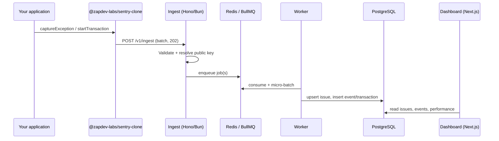

# Architecture

## End-to-end flow

Design goal: **ingest never blocks on PostgreSQL writes**. The hot path is validation, DSN lookup, and enqueue only.

## Ingest service

- **Runtime**: Bun with Hono `fetch` export.
- **Auth**: `X-Open-Sentry-Key` header (legacy: `X-Sentry-Clone-Key`) or `?key=` query (browser beacons).
- **Body limit**: 256 KiB (`MAX_BODY_BYTES` in `@sentry-clone/db`).
- **Payload**: Single item or array (1–20 items). Schemas live in `packages/db/src/ingest-types.ts`.
- **DSN resolution**: `apps/ingest/src/dsn-cache.ts` — memory (60s) → Redis (300s) → Postgres lookup with inflight deduplication.
- **Response**: Always `202 Accepted` with `{ id: batchId }` on success.

## Queue and worker

| Setting | Value | Location |
|---------|-------|----------|
| Queue name | `ingest-events` | ingest + worker |
| Max batch enqueue | 20 items | ingest validation |
| Worker micro-batch | 50 jobs or 100ms wait | `apps/worker/src/index.ts` |
| Job retries | 3, exponential backoff | ingest queue defaults |
| Worker concurrency | 5 | worker |

Each job carries `{ projectId, payload, receivedAt }`. The processor runs a **single transaction** per flushed batch and branches on `payload.type`:

- **`error`**: fingerprint → upsert `issues` → insert `events`
- **`transaction`**: insert `transactions` → optional `spans`

## Issue grouping

Fingerprints are SHA-256 hashes of exception type, message, and the last three in-app stack frames (`packages/db/src/grouping.ts`). Colliding fingerprints increment `event_count` and update `last_seen` via `ON CONFLICT`.

## Data model (core tables)

| Table | Purpose |
|-------|---------|
| `projects` | Org-scoped project; `public_key` for ingest auth |
| `issues` | Grouped errors by fingerprint + status |
| `events` | Individual error occurrences |
| `transactions` | Performance traces |
| `spans` | Child spans under a transaction |

Auth tables (Better Auth) live in `packages/db/src/auth-schema.ts` and are migrated alongside app tables.

## Dashboard

- **Auth**: Better Auth with organization plugin; projects belong to `organization_id`.
- **Session**: Middleware requires a session cookie except public routes (`/login`, `/signup`, `/docs`, health, auth API).
- **Reads**: Server components and `lib/queries.ts` — filtered by active organization.

## SDK transport

- Buffers items; flushes every 2s or at 20 items.
- Browser: prefers `navigator.sendBeacon` with query key; falls back to `fetch` with `keepalive`.
- Node: `fetch` + `beforeExit` flush hook.

## Failure modes

| Failure | Behavior |
|---------|----------|
| Invalid JSON / schema | `400` from ingest |
| Unknown public key | `403` |
| Redis down | Ingest cannot enqueue — surface as 5xx |
| Worker down | Queue grows; events delayed, not dropped until Redis eviction policy applies |
| Network from SDK | Silent drop (no retry queue in SDK v0) |

## Scaling notes

- Horizontal **ingest** replicas share Redis + Postgres; DSN cache is distributed via Redis.
- **Workers** scale with concurrency; watch Postgres connection pool (`createDb` pool size).
- Partial index `issues_open_partial_idx` optimizes open-issue lists per project.
